# SETUP STEPS TO RUN WEBSITE IN YOUR LOCAL SYSTEM

  ## Below is the list of Softwares and tools you need to run this website locally.

   * [ ] **Step 1.** Use Ninite and install JRE and Eclipse

   * [ ] **Step 2.** Download and Setup Apache tomcat v8.5
  
   * [ ] **Step 3.** Download SSMS and execute initial script.
  
   * [ ] **Step 4.** Install JEE perspective if not available with your Eclipse.(optional)
   
   * [ ] **Step 5.** Link Apache Tomcat Server to Eclipse.
  
  
  
  ### **Step 1.** Install JRE and Eclipse.
  
   To install JRE and Eclipse at once you can use [ninite](https://ninite.com/).
   Navigate to the above mentioned link and click on _Java (AdoptOpenJDK) x64 11_ and _Eclipse_ checkbox, next click on _Get your Ninite_     button.
  
   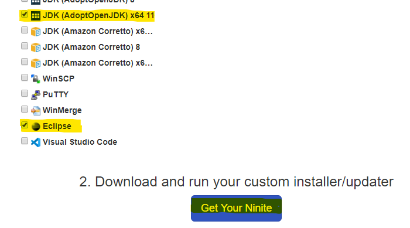
   
   On Clicking  **Get Ninite** an exe file will be downloaded.
   
   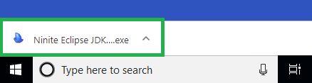
   
   Double click on downloaded exe, I will start installing **JRE** and **Eclipse**
   
   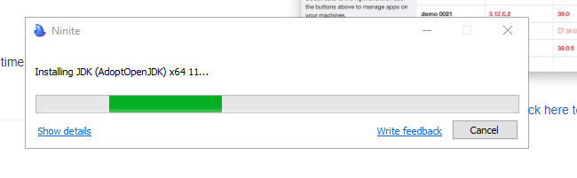
  
   Congratulations, you have just setup 25% of development environment.
  
   * [x] **Step 1.**

### **Step 2.** Download Apache tomcat v8.5.

  To install Apache Tomcat v8.5, open your browser and navigate to [tomcat](http://tomcat.apache.org/)
  
  You will be redirected to page shown below
  
  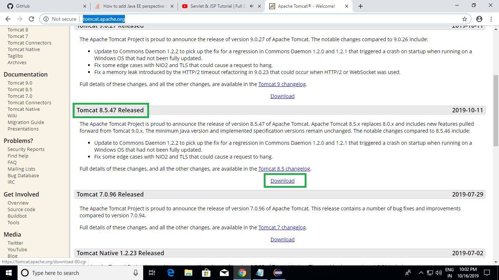
  
  Click [download](https://tomcat.apache.org/download-80.cgi) button under **Tomcat 8.5.47 Released**
  
  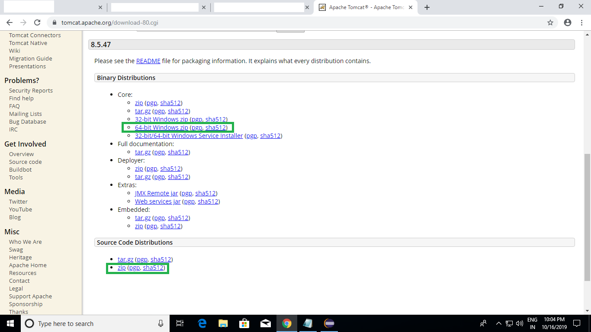
  
  Download both [Binary Distribution](http://apachemirror.wuchna.com/tomcat/tomcat-8/v8.5.47/bin/apache-tomcat-8.5.47-windows-x64.zip) and [Source Code Distribution](http://apachemirror.wuchna.com/tomcat/tomcat-8/v8.5.47/bin/embed/apache-tomcat-8.5.47-embed.zip)
  
  Once it is downloaded, extract downloaded zip folder as shown below
  
  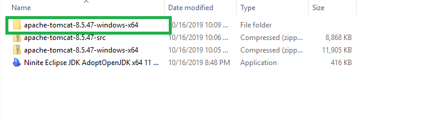
  
  Next step will be to include server in Eclipse.
  
  * [x] **Step 2.**
  
### **Step 3.** Download SSMS.

  To View Database and data in Tables you need an interface. SSMS(SQL Server Management Studio) is a tool where you can query to your database. Since we are using Azure SQL here we will be skipping the installation of SQL Server locally and this also means that to access the database (even to run this website locally) you need an **internet Connection**. If you don't want to use Azure SQL then please install SQL Server into your local machine and create all required Tables into it, update credentials in [DatabaseCredentials.java](OHGH/project/src/com/ohdgh/db/DatabaseCredentials.java) file of the project.
  
  To install SSMS, open your browser and navigate to "https://docs.microsoft.com/en-us/sql/ssms/download-sql-server-management-studio-ssms?view=sql-server-ver15" url
  
  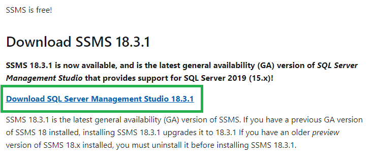
  
  Click on the [link](https://aka.ms/ssmsfullsetup) as shown above
  
  Once it is downloaded please double click to run the exe file and start the installation
  
  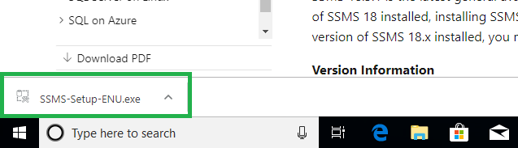
  
  It will ask you the location for SSMS keep as it is.
  
  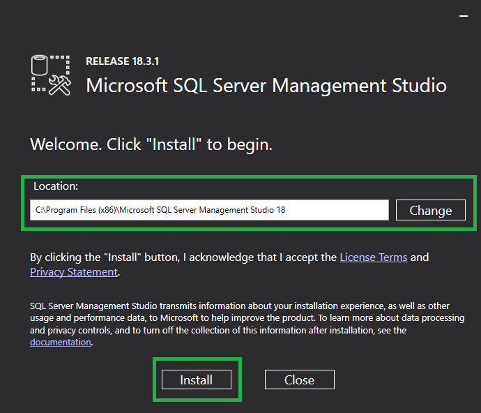
  
  Click on install, it will start installation.
  
  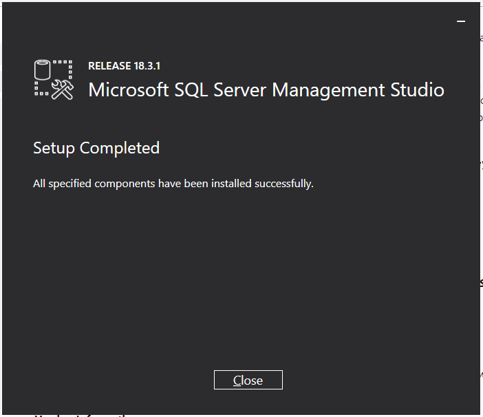
  
  SSMS is installed successfully, next step is to connect database with SSMS.
  
  For that first open SSMS.
  
  <kbd>Windows</kbd> -> Type SSMS -> <kbd>Enter</kbd>
  
  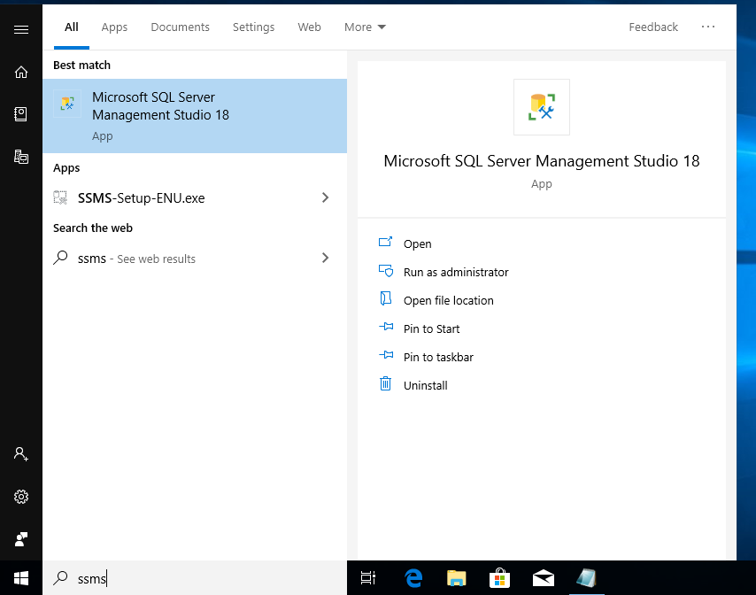
  
  As SSMS opens select Connect -> Database Engine on top left corner.
  
  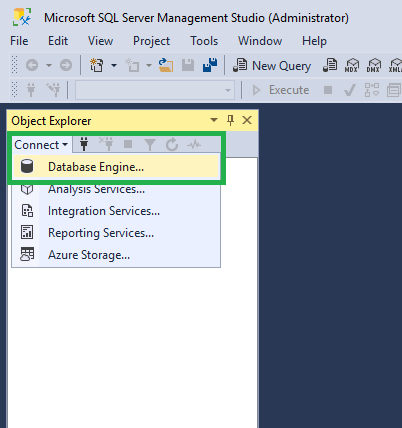
  
  Enter your details and select Authentication type as **SQL Server Authentication** and click Connect.
  
  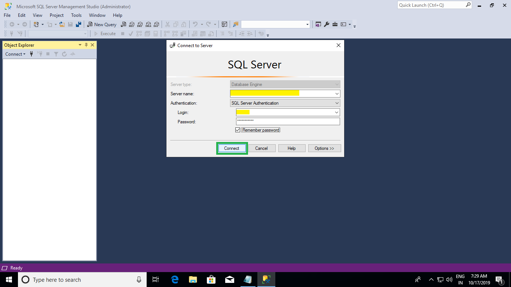
  
  You are all set to access database.
  
  To query to database click on new query and select your database as it is shown in image below.
  
  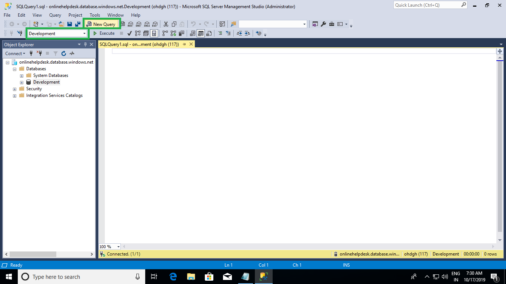
  
  * [x] **Step 3.**
  
### **Step 4.** Install JEE perspective if not available with your Eclipse.(optional)
  If you have worked on JEE (Java Enterprise Edition) previously then then Eclipse will be there with JEE Perspective.
  Otherwise follow the below steps.
  
  First open Eclipse which is installed in step 1.
  <kbd>Windows</kbd> -> Eclipse -> <kbd>Enter</kbd>
  
  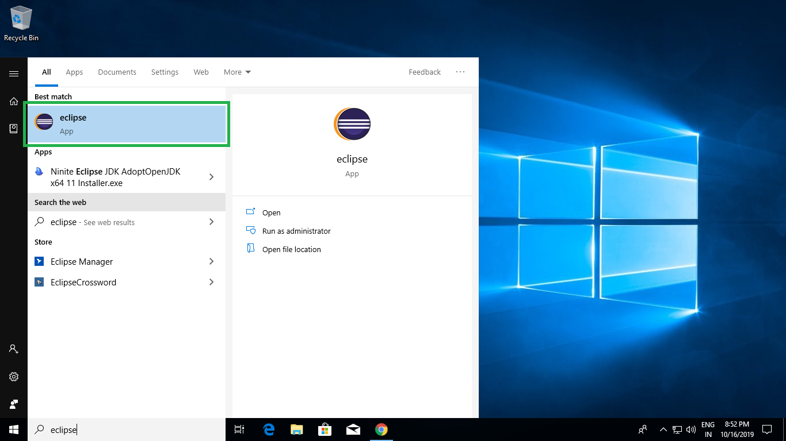
  
  If you are starting Eclipse for the first time then it will ask you for a workspace location, please specify the workspace location here.
  
  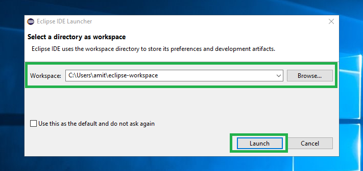
  
  Navigate to Help -> Install New Software.. on top of the tool bar.
  
  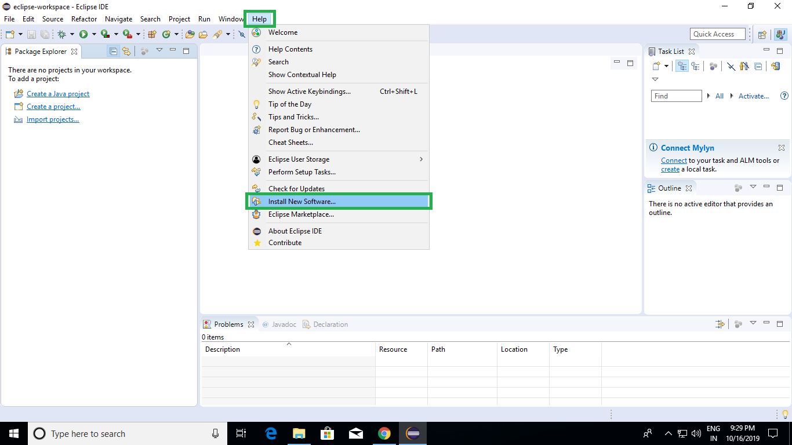
  
  Select the following packages to install:

       "Web, XML, Java EE and OSGI Enterprise Development". 
       "Programming langauges -> Eclipse Java Development Tools"
       
  and click **Next**
       
  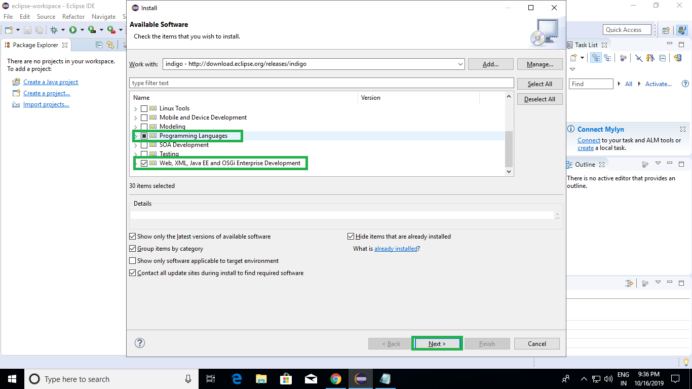
  
  Enter Name as indigo and Location as http://download.eclipse.org/releases/indigo and click on **Add**
  
  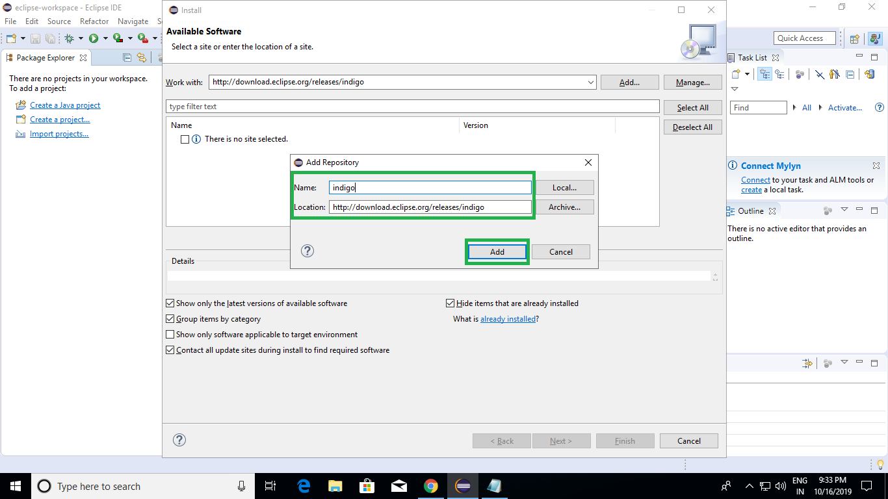
  
  Now you are ready with Jee Perspective
  
  * [x] **Step 4.**
  
### **Step 5.** Link Apache Tomcat Server to Eclipse.
  To run this website locally you will need a server, here we will use Apache Tomcat, it is free and you can integrate it with Eclipse easily.
  
  To link Tomcat to Eclipse you need to complete Step 1 and Step 2 first.
  
If you have completed the above steps then.
Open Eclipse.
and Navigate to Servers tab as shown below.

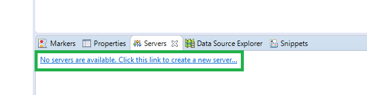

and click on the highlighted place shown.
on clicking a popup window will open
Select Tomcat v8.5 Server and click **Next**.

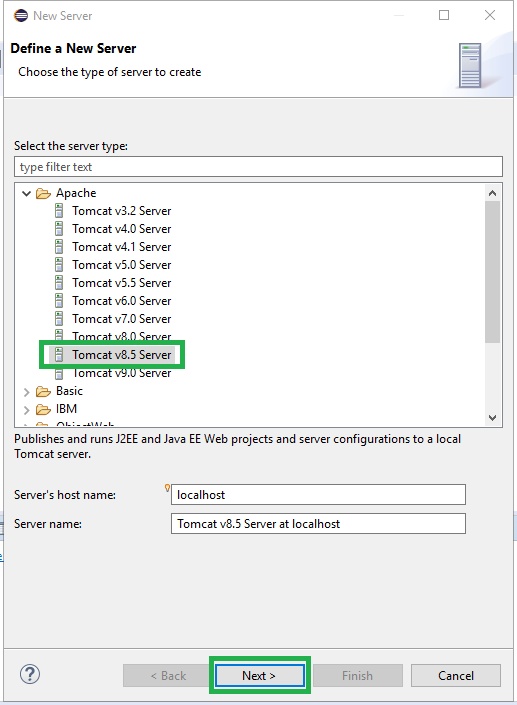

Select the unzipped folder location of the tomcat server as shown in the below image.

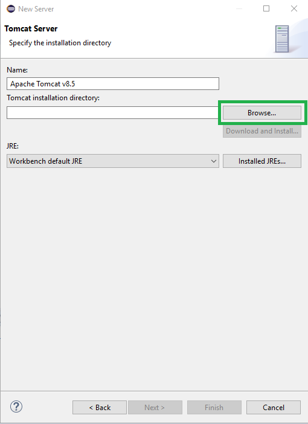

Final step is to click on Finis and you will be ready with your development environment.

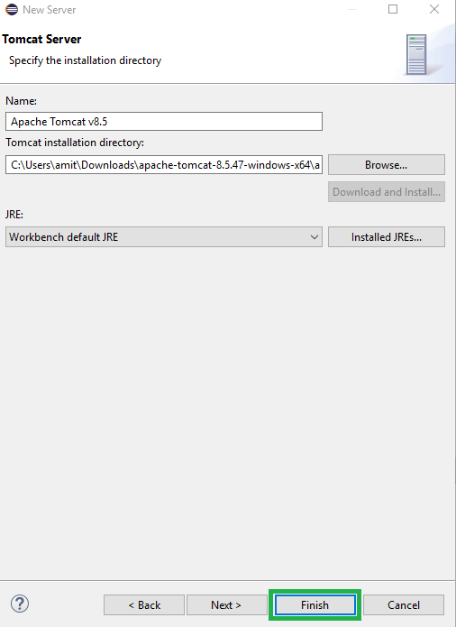

* [x] **Step 5.**

***Yay You are ready with your development environment.***
  
To execute the code on your local machine, Download the code from [repository](https://github.com/kumaramitrou/OHGH/tree/ohdgh) unzip it next open it in eclipse.

To open it in eclipse first select Jee Perspective by clicking on small button below close **x** mark on top right hand corner, you will have a popup as shown below.

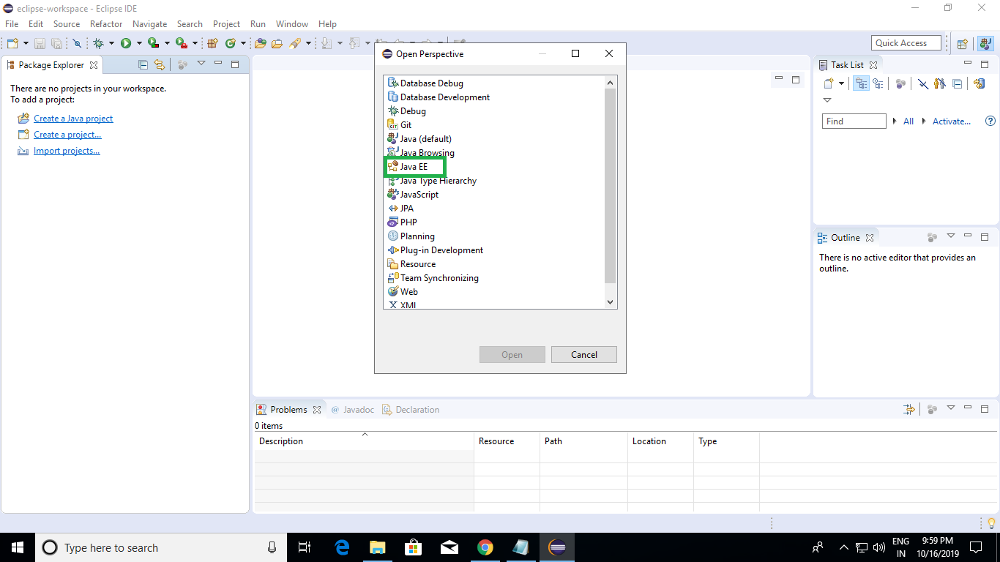

and select Java EE.

